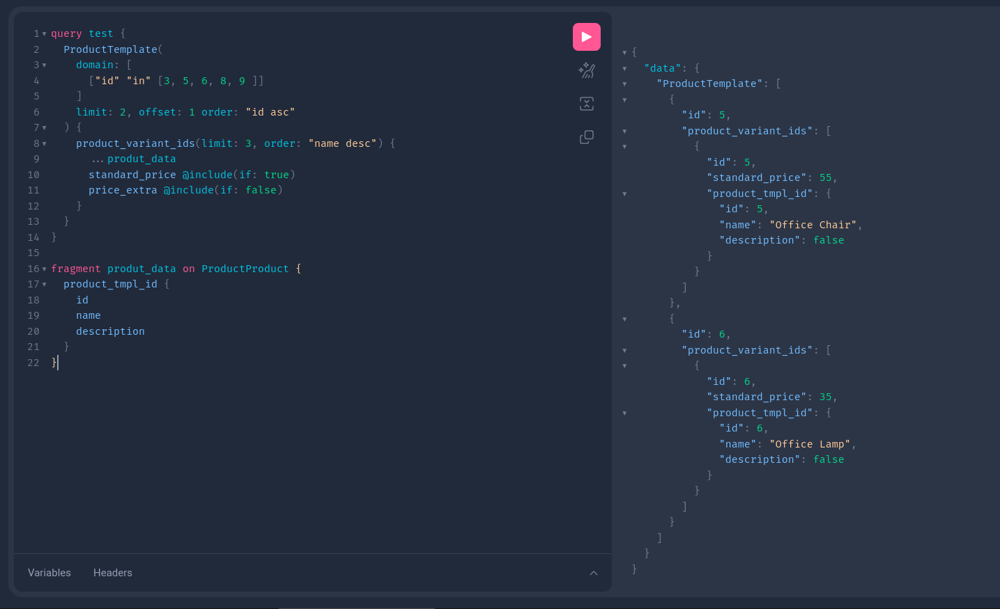

# README

Graphql provides a simplier and more efficient way to query data than you would currently do in Odoo (using for example xmlrpc or jsonrpc).

This module adds a generic way to do graphql queries and mutations on Odoo server.
This module takes into account any installed modules and use the Odoo permissions (Access rights and access rules).


```javascript
query Tickets {
    HelpdeskTicket(domain: $domain, limit: $limit) {	
        name
        description
        user: user_id @include(if: $user_info) {
            name
        }
        stage_id {
            name
        }
        partner_id @include(if: $partner_id)  {
            image: image_1920 @include(if: $image)
            user_id {
            	name
            }
        }
    }
}
```

To use the query:

```python
requests.get("https://myodoo.com/graphql",
    # Header not required currently but recommended
    headers={"Content-type": "application/graphql"},  
    data={
        "query": myquery,
        "variables": {},  # Optional
        # https://dgraph.io/docs/graphql/api/multiples/#multiple-operations
        "operationName": None  # Optional, used for multi-operation document
	},
)
```

```javascript
await fetch("/graphql", {
    method: "POST",
    body: JSON.stringify({
        query: myquery,
        variables: myvariables,
    }),
}).then((res) => res.json());
```


You can also perform **mutations**

```javascript
mutation Test {
    tickets: HelpdeskTicket(domain: $domain, vals: {name: $name, description: $description}) {
        name
    }
}
```

It will:

* Perform a write if a domain is provided
* Perform a create if no domain is provided
  That means `null` value! If you provided an empty list you are going to perfom a write on ALL RECORDS


This can be used in the same way in any other languages, as javascript.
Be aware that this module **DOES NOT HANDLE CORS**, that means that without any other changes, you will only be able to make queries from the Odoo frontend in javascript, but not from an extenal website (see below for more informations).


The route <strong>/graphql/schema</strong> will provide you with all the types you can query.
Accessing this url through a web-browser will download the schema in a file.

Nb: This feature is under development. The goal is to be compliant with a graphql edit as GraphiQL.
In fact, this will list all the types (and their fields) you <strong>might</strong> be able to query, this refer to access rights and access rules of the user doing the query.
For example, the public user (not authenticated) has by default not right over the products, but there is an access rule allowing him to access SOME products. But Odoo does not provide groups for most fields, that means anyone can query any field of a record they have access to. This issue exists from the beginning of Odoo, even without this module, one can easily get all fields of a record using the natives xmlrpc and jsonrpc.


### Usage and examples

You can find examples under the `examples` folder. Inside it you will find utilities file for javascript and python. Please, take a look at those files first.


## Introspection

Introspection is not fully working for the moment but works for the integrated [GraphiQL Editor](https://github.com/graphql/graphiql).
The editor must **NOT** be active on production database: it exposes your whole database schema, this will help attackers to gain informations about your Odoo. Also, parsing introspection is a lot heavier than normal queries.

Therefore, the GraphiQL Editor AND the introspection in general are **DISABLED BY DEFAULT**.
To activate bother the editor and introspection, you need to **create** (it does not exist by default) the `odoo_graphql.introspection` system parameter to `True` (case insensitive)


Nb: To access it: (in developer/debug mode) Settings -> Technical -> System Parameters
        Then just click "Create"



GraphiQL is available at `/graphiql` (just that, nothing else)


## External Website

You may want to create a custom website for your Odoo using modern technolgies as VueJS, ReactJS, ...
You can do it without this module using a proxy (E.g.: see my side project [odoo_nginx_proxy](https://github.com/divad1196/odoo_nginx_proxy)) and using the already existings routes and xmlrpc/jsonrpc.
(Modules allowing it may exists)


You will then need to allow many parameters to be able to fetch your Odoo.
**BUT** all of this is already done for you:

If you have an url authorizing your website, you may want to use the library provided in this module **graphql.js**

```javascript
const odoo = odoo_builder(myurl, "mydatabase");  // Nb: myurl is a string

// it provides you with a simple way to login/logout and to retrieve your sessions information
let session = await odoo.login(login, password);
// session = await odoo.session()
odoo.logout();

// And obviously, it allows you to make graphql queries
odoo.graphql(
    myquery,	   // Mandatory
    myvariables,   // Optional
    operationName, // Optional, only usefull for multi-operation document
)
```

Nb: Those works using the defaults routes of Odoo. If you have changed them using your proxy, you will need to make your own _odoo_builder_. To help you, the __odoo_utils_ structure is made for you.


